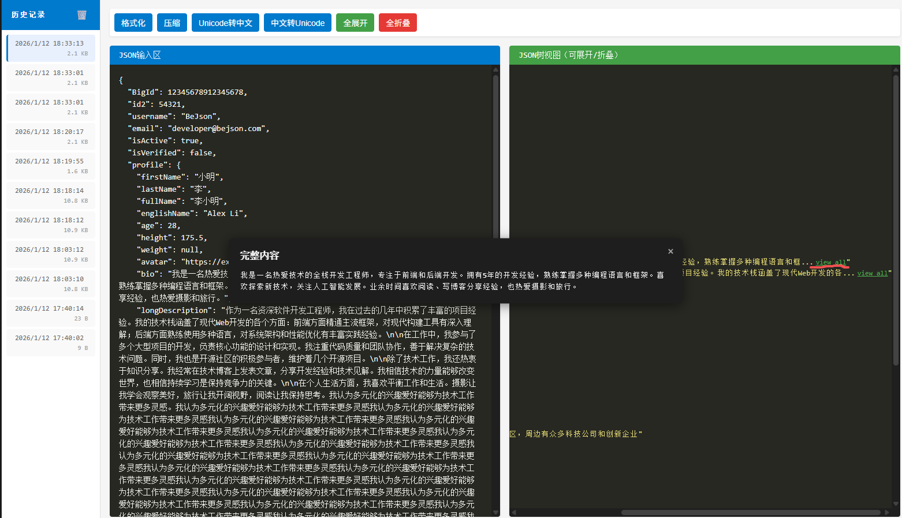

# Change Log

All notable changes to the "json-converter" extension will be documented in this file.

Check [Keep a Changelog](http://keepachangelog.com/) for recommendations on how to structure this file.

Added for new features.
Changed for changes in existing functionality.
Deprecated for soon-to-be removed features.
Removed for now removed features.
Fixed for any bug fixes.
Security in case of vulnerabilities.

## [Unreleased]

## [1.0.1] - 2026-01-13

### Fixed
修复超长JSON导致的显示异常
增加超长字段精简展示，并提供view all，点击后展示详情

## [1.0.0] - 2026-01-12

### Added
- 🎨 **JSON格式化** - 将压缩的JSON转换为易读的格式
- 📦 **JSON压缩** - 将格式化的JSON压缩为一行
- 🔤 **Unicode转换** - 支持Unicode与中文互转
- 🌲 **树形视图** - 直观的JSON结构树形展示，支持展开/折叠
- 📚 **历史记录** - 自动保存操作历史，方便快速访问
- 🛠️ **多格式支持** - 支持各种JSON格式的处理
- 🌐 **可视化界面** - 用户友好的图形界面，操作简单直观
### Changed

### Deprecated

### Removed

### Fixed

### Security

