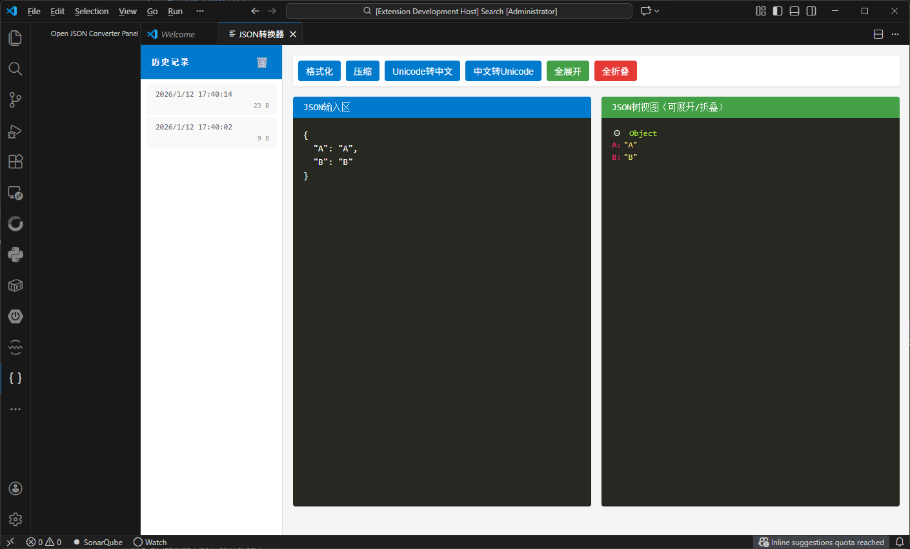

# JSON Converter

[](https://github.com/light-dot/json-converter)
[](LICENSE)


一个功能强大的JSON格式化、压缩和转换工具，专为VS Code设计的可视化插件。

## 功能特性

- 🎨 **JSON格式化** - 将压缩的JSON转换为易读的格式
- 📦 **JSON压缩** - 将格式化的JSON压缩为一行
- 🔤 **Unicode转换** - 支持Unicode与中文互转
- 🌲 **树形视图** - 直观的JSON结构树形展示，支持展开/折叠
- 📚 **历史记录** - 自动保存操作历史，方便快速访问
- 🛠️ **多格式支持** - 支持各种JSON格式的处理
- 🌐 **可视化界面** - 用户友好的图形界面，操作简单直观

## 界面预览



## 安装

### 从VS Code Marketplace安装（推荐）

1. 打开VS Code
2. 进入扩展面板（Ctrl+Shift+X）
3. 搜索"JSON Converter"
4. 点击安装

### 从VSIX文件安装

1. 下载最新的VSIX文件
2. 在VS Code中，进入扩展面板
3. 点击"..."菜单，选择"从VSIX安装"
4. 选择下载的VSIX文件

## 使用方法

1. 安装扩展后，点击左侧活动栏中的JSON图标
2. 在输入区粘贴或输入JSON内容
3. 使用工具栏按钮进行各种操作：
   - **格式化** - 格式化JSON使其更易读
   - **压缩** - 压缩JSON为单行
   - **Unicode转中文** - 将Unicode编码转换为中文
   - **中文转Unicode** - 将中文转换为Unicode编码
   - **全展开** - 展开所有树节点
   - **全折叠** - 折叠所有树节点
4. 查看右侧的树形视图，直观了解JSON结构
5. 通过历史记录面板快速访问之前处理的JSON

## 开发指南

### 项目结构

```
json-converter/
├── src/
│   ├── extension.ts     # 扩展主入口
│   └── test/            # 测试文件
├── images/              # 图标和截图
├── .vscode/             # VS Code配置
├── package.json         # 项目配置
├── tsconfig.json        # TypeScript配置
├── eslint.config.mjs    # ESLint配置
├── .vscodeignore        # 打包忽略文件
└── README.md            # 说明文档
```

### 本地开发

1. 克隆项目：
   ```bash
   git clone https://github.com/light-dot/json-converter.git
   cd json-converter
   ```

2. 安装依赖：
   ```bash
   npm install
   ```

3. 编译项目：
   ```bash
   npm run compile
   ```

4. 在VS Code中按F5启动调试模式

### 构建和打包

1. 编译代码：
   ```bash
   npm run compile
   ```

2. 打包为VSIX：
   ```bash
   vsce package
   ```

## 贡献

欢迎提交Issue和Pull Request来改进这个项目！

### 开发计划

- [ ] 支持更多JSON操作功能
- [ ] 增加自定义配置选项
- [ ] 支持多语言界面
- [ ] 优化性能和用户体验

## 许可证

本项目采用MIT许可证，详情请见[LICENSE](LICENSE)文件。

## 更新日志

查看[CHANGELOG.md](CHANGELOG.md)了解版本更新详情。